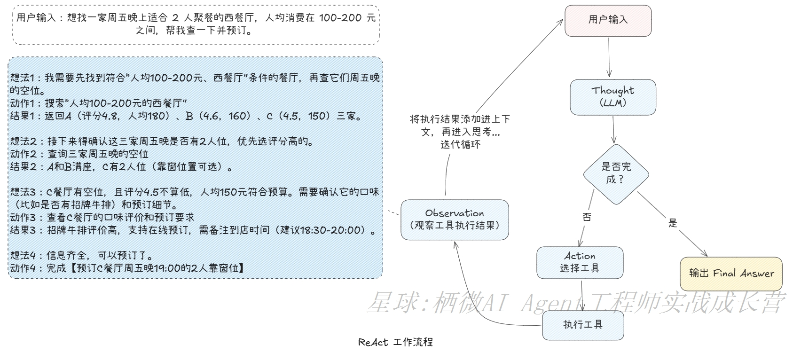
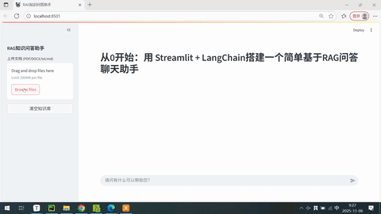

## 项目介绍

本项目是知识星球专栏《栖微 AI Agent 工程师实战成长营》的配套代码库，包含 AI Agent 开发的核心实践案例，涵盖记忆管理、工具调用、自我学习、工作流编排、RAG（检索增强生成）、认知策略等关键功能模块。通过实际可运行的代码示例，帮助开发者理解 AI Agent 的核心原理与实现方式，为学习 AI Agent 的开发者提供实践参考。

## 代码结构

项目整体结构，按功能模块划分如下：

```plaintext
tidy-agent-practice-open/
├── agent_architecture/        # AI Agent 核心架构组件
│   ├── memory/                # 记忆管理模块相关代码
│   ├── workflow/              # 工作流编排模块相关代码
│   ├── learn/                 # 自我学习模块相关代码
│   └── tools_augmented/       # 工具调用模块（含functioncalling、mcp、工具指令解析）
├── cognitive_pattern/    	   # 认知策略
│   ├── react/                 # ReAct 模式代码实现
│   ├── self_ask/              # self_ask 模式代码实现
│   ├── self_refine/           # self_refine 模式代码实现
│   ├── rewoo/        		   # rewoo 模式代码实现
│   ├── Plan-and-execute/      # Plan-and-execute(规划与执行)模式代码实现
│   └── LLM Compiler/          # LLM Compiler模式代码实现
├── data/                      # 放置本地模型文件
├── llm/                       # 大语言模型调用与结构化输出封装
│   ├── langchain/             # 基于LangChain框架的模型调用封装
│   └── reranker/              # reranker模型调用封装
├── rag_demo/                  # RAG 技术演示
├── practice_cases/            # 实战案例集合
│   └── simple_rag_assistant/  # 简易 RAG 问答助手项目（含Streamlit界面）
│   └── smart_customer_service_assistant/  # 企业电商客服助手智能体项目
│   └── smart_customer_service_assistant_mcp/  # 企业电商客服助手智能体系统（基于FastMCP）
├── streamlit_demo/            # Streamlit 交互界面示例
├── tools/                     # 工具（含天气、搜索、网页爬取等）
├── requirements.txt           # 项目依赖
└── .env.template              # 环境变量配置模板
```

## 部分模块说明

### 1. agent_architecture（AI Agent 技术架构）

结合实践经验，提出构建AI Agent的整体技术架构，包括八个模块。如下图所示：


AI Agent的运行流程图如下：


#### 1.1 memory（记忆管理）模块

实现 AI Agent 的对话记忆管理策略，包含短期记忆方案和长期记忆方案。

短期记忆以下五种典型的实现模式：

1. **裁剪记忆模式（Trim）**：只保留最近的若干条对话，超出设定记忆长度的旧对话会被舍弃。例如，设置记忆长度为 5，就只保留最新的 5 条对话。
2. **总结记忆模式（Summarize）**：当对话数量超过记忆长度时，利用模型自动总结历史对话。比如，输入多条消息后，超过记忆长度时模型会将之前的对话内容概括成简短的总结，输入模型上下文的信息为总结加上最近记忆长度的对话记录，减少了输入模型的内容长度。但总结本身也会产生额外成本，每次执行提问，都要对过往对话进行总结，也会影响应用效率 。
3. **裁剪 + 总结记忆模式（Trim+Summarize）**：结合了裁剪和总结两种策略。对话数量达到一定阈值，先对超出部分进行总结，再裁剪仅保留阈值数量的最近对话和总结内容，有效减少了存储的历史会话数量。
4. **定期总结记忆模式（Regularly Summarize）**：按照设定的间隔，对对话进行总结。比如，间隔设为 3，每新增 3 条消息，就会对这段时间的对话生成总结。
5. **分层记忆模式（Hierarchical）**：将对话分为短期记忆和长期记忆。短期记忆保留最近消息，超出一定数量后，旧消息移到长期记忆；长期记忆满时，会总结并删除最早（由设定阈值）的对话消息。

代码位于项目根目录下：`agent_architecture/memory`

#### 1.2 tools_augmented（工具调用）模块

提供 Agent 可调用的外部工具实现，扩展 Agent 能力边界。

Agent中工具的调用模式主要有以下三种：

- **工具增强型提示**：是一种通过在提示词中直接描述工具功能、参数及输出格式，引导大语言模型生成规范的工具（函数）调用指令（如按JSON格式输出需要调用的函数名称及其参数）。该方法简单但依赖精细的提示工程及大模型指令的遵循能力。  
- **Function Calling（函数调用 ）**：这一技术让开发者能够定义函数（也被称为工具 tools）,通过接口请求模型时，附带上定义的函数描述；大模型会智能地选择需要调用的函数，并以格式化结构方式输出调用的函数名称及其参数（一般按 JSON格式）。
- **MCP协议（Model Context Protocol）**：是一种定义模型与工具交互的上下文协议，由 Anthropic 公司于 2024 年11月提出。旨在解决不同大语言模型(LLM)与不同外部工具集成的标准化问题。通过MCP，开发者能够以一种统一的方式将各种数据源和工具连接到 Al 大模型，从而提升大模型的实用性和灵活性。

代码位于项目根目录下：`agent_architecture/tools_augmented`

#### 1.3 learn（自我学习）模块

学习模块是 AI Agent 实现 “持续学习与自我优化” 的核心引擎，核心职责是从任务执行结果中精准提炼经验与教训，动态迭代自身决策逻辑与行为模式。主要有以下两种模式：

- **self_learning_agent.py**：依托「交互 - 反思 - 学习」的自改进智能体。
- **self_learning_with_eval_agent.py**： 依托「交互-评价-反思-学习」的自改进智能体。

代码位于项目根目录下：`agent_architecture/learn`

#### 1.4 workflow（工作流编排）模块

工作流的编排方式是通过预定义编码路径来协调 LLM 和工具的使用，适用于有固定任务流程的场景。经过梳理后整理为7种模式：

1. 提示链式调用（Prompt chaining）
2. 门控机制（Gating）
3. 路由（Routing）
4. 并行化（Parallelization）
5. 投票机制（Voting）
6. 编排者-工作者（Orchestrator-workers）
7. 评估器-优化器（Evaluator-optimizer）

代码位于项目根目录下：`agent_architecture/workflow`

#### 1.5 Context Management(上下文管理)模块

为大语言模型（LLM）的上下文窗口填充恰好适用于下一步任务的信息。


### 2. cognitive_pattern（认知策略）

#### 2.1 ReAct 模式

实现 "思考 - 行动 - 观察" 循环的认知模式，支持工具调用。



完整代码位于项目根目录下：`cognitive_pattern/react`

#### 2.2 Self-ask

Self-ask 是针对 “多步问答任务” 设计的认知策略，通过模拟人类 “自问自答” 的分层推理逻辑，将复杂问题拆解为一系列子问题，逐步逼近最终答案，尤其适用于需要多轮信息验证的任务。


完整代码位于项目根目录下：`cognitive_pattern/self_ask`

#### 2.3 Self-Refine

 `SELF-REFINE` 是一种迭代自我优化算法。其核心思想：SELF-REFINE 使用同一基础语言模型对其初始输出生成反馈并优化输出，在两个生成步骤 ——“**反馈（FEEDBACK）**” 和 “**优化（REFINE）**” 之间循环交替进行，这两个步骤协同工作以生成高质量输出。


完整代码位于项目根目录下：`cognitive_pattern/self_refine`

#### 2.4 plan_and_solve（规划与执行）

`plan-and-execute`框架核心逻辑可概括为 “先全局规划、后分步执行、再动态调整” 的闭环逻辑：借助 LLM 对任务进行整体规划，生成完整分步计划；再按照计划有序执行，并根据执行反馈（如工具调用结果）对计划进行动态优化，形成 “规划 - 执行 - 反馈 - 调整” 的完整链路。既保留了 ReAct 的灵活性，又弥补了其全局统筹能力的不足。

工作流程图如下：


完整代码位于项目根目录下：`cognitive_pattern/plan_and_solve`

### 3. llm（大语言模型调用封装）

- **核心功能**：封装大语言模型调用接口，支持结构化输出。
- **关键文件：**
  - `llm/call_llm.py`：基于OpenAI SDK实现模型调用。
  - `llm/call_llm_struct.py`：基于OpenAI SDK实现模型调用，并生成结构化数据响应（JSON格式）。
  - `langchain/langchain_llm.py`：基于 LangChain 实现通用模型调用。
  - `langchain/langchain_llm_struct.py`：基于 LangChain 实现结构化输出。

### 4. rag_demo（检索增强生成示例）

- **核心功能**：实现基于向量数据库的检索增强生成技术。
- **关键文件：**
  - rag_query.py：完整的 RAG 流程示例，`run_rag_main` 函数包含文档加载、分块、向量化、检索和生成回答的全流程，支持指定检索数量（k 值）和模型类型。

### 5. practice_cases（实战案例）

#### 5.1 simple_rag_assistant（简易 RAG 问答助手）

基于 Streamlit 和 LangChain 的简单 RAG 问答系统，实现文档上传、内容解析与并基于检索文档内容进行智能问答。




## 快速安装

### 一、设置虚拟环境

#### 1. 配置Conda 虚拟环境（安装 Conda，若未安装）

- 下载地址：https://docs.conda.io/en/latest/miniconda.html（conda 轻量化，推荐）

- 安装流程：

  - Windows：双击安装包，勾选 "Add Miniconda3 to PATH"（方便命令行调用）
  - Mac/Linux：执行安装脚本，按提示完成（默认会添加环境变量）

- 验证安装：打开终端 / 命令提示符，输入`conda --version`，显示版本号则成功

  ```
  D:\dev > conda --version
  conda 23.1.0
  ```

#### 2. 创建并激活 Conda 虚拟环境

1. 打开终端 / 命令提示符，执行以下命令创建虚拟环境（Python 版本指定 3.11）：

   ```bash
   # 创建虚拟环境(名称tidy-agent-practice-env可随意，也可使用其它已存在的虚拟环境)，指定Python 3.11
   conda create -n tidy-agent-practice-env python=3.11
   ```

   过程中会提示安装依赖，输入`y`确认。

2. 激活虚拟环境：

   - Windows（命令提示符）：

     ```cmd
     conda activate tidy-agent-practice-env 
     # 若执行不了，尝试：conda.bat activate tidy-agent-practice-env
     ```

   - Mac/Linux：

     ```bash
     conda activate tidy-agent-practice-env
     ```

   激活成功后，终端前缀会显示`(tidy-agent-practice-env)`

   如：

   

### 二、下载项目并安装依赖

#### **1. 下载项目**

```bash
git clone https://github.com/tinyseeking/tidy-agent-practice.git
# 进入下载项目的根目录
cd tidy-agent-practice
```

#### 2. 安装依赖

这里介绍两种主要方式安装依赖：

##### 方法 1：在 Conda 环境中用 `pip` 安装（最通用，兼容性最好）

1. 激活 Conda 环境

```bash
conda activate tidy-agent-practice-env
```

2. 用 `pip` 安装 `requirements.txt`

这是最传统的方式，利用 Conda 环境中内置的 `pip` 直接安装 `requirements.txt`，无需额外工具。

```bash
# 基础安装
pip install -r requirements.txt

# 国内用户可指定 PyPI 镜像加速，清华源
pip install -r requirements.txt -i https://pypi.tuna.tsinghua.edu.cn/simple
##其它替代镜像源列表
# 阿里云镜像加速
pip install -r requirements.txt -i https://mirrors.aliyun.com/pypi/simple/
# 中国科学技术大学镜像加速
pip install -r requirements.txt -i https://pypi.mirrors.ustc.edu.cn/simple/
```

**注意**：

- 确保 `pip` 属于当前 Conda 环境（执行 `which pip`（Linux/Mac）或 `where pip`（Windows），路径应指向 Conda 环境的 `bin/pip` 或 `Scripts/pip.exe`）。
- 若 Conda 环境中无 `pip`，可先执行 `conda install pip` 安装。

##### 方法 2：在 Conda 环境中用 `uv` 安装（推荐，速度最快）

`uv` 是新一代 Python 包管理工具，解析和安装 `requirements.txt` 的速度远快于 `pip`，且能完美兼容 Conda 环境。

**步骤 1：激活 Conda 环境**

```bash
conda activate tidy-agent-practice-env
```

**步骤 2：确保环境中安装了 `uv`**

如果未安装，可通过以下命令快速安装：

```bash
# 单二进制文件安装（推荐，不污染依赖）
curl -LsSf https://astral.sh/uv/install.sh | sh

# 或用 pip 安装
pip install uv
```

**步骤 3：用 `uv` 安装 `requirements.txt`**

```bash
# 极速安装依赖（自动识别 Conda 环境的 Python）
uv pip install -r requirements.txt

# 若需强制升级包，添加 --upgrade
uv pip install --upgrade -r requirements.txt
```

**优势**：解析速度极快、支持并行下载、能严格锁定依赖版本，是处理 `requirements.txt` 的最优选择。

### 三、环境变量设置

项目使用 `.env` 文件管理环境变量，主配置文件需放在项目根目录，部分子项目也可在其目录下单独创建 `.env` 文件。

操作方法：

1. 复制根目录的 `.env.template` 模板文件；
2. 重命名为 `.env`；
3. 按需修改文件内的配置参数。

修改配置说明如下：

```env
####################################
# 模型访问key及接口地址
####################################
# 千问模型接口访问key，默认;若使用其它模型，需配置相应的API_KEY和BASE_URL
# 如何获取API Key：https://help.aliyun.com/zh/model-studio/developer-reference/get-api-key
QWEN_API_KEY="你的千问API Key"
# 千问模型接口访问地址
QWEN_BASE_URL="https://dashscope.aliyuncs.com/compatible-mode/v1"

# 智谱清言模型
ZHIPU_API_KEY="你的智谱API Key"
ZHIPU_BASE_URL="https://open.bigmodel.cn/api/paas/v4/"

# 设置 deepseek 接口访问key,需要替换为你自己的
DEEPSEEK_API_KEY="你的DeepSeek API Key"
# 设置 deepseek 接口访问地址
DEEPSEEK_BASE_URL="https://api.deepseek.com"

# 设置 OPENAI 接口访问key,需要替换为你自己的
OPENAI_API_KEY="你的OpenAI API Key"
# 设置 OPENAI 接口访问地址
OPENAI_BASE_URL="https://api.openai.com/v1"

####################################
# 第三方服务接口
####################################
# tavily 搜索API KEY
# 访问 https://tavily.com 注册并获取API Key,用户每月有1000次免费调用额度.
TAVILY_API_KEY="你的Tavily API Key"

# 和风天气API配置,和风天气API文档地址 https://dev.qweather.com/docs/start/
# 请替换为你的KEY
HEFENG_API_KEY="a2add535d10***"
# 替换为你自己的和风 API Host。获取地址：https://console.qweather.com/setting?lang=zh
# API Host是开发者独立的API地址，用于取代传统的公共API地址
HEFENG_BASE_URL="https://mh7**.re.qweatherapi.com"
```

#### 各 API 密钥获取步骤

1. **千问模型（QWEN_API_KEY）**

   - 注册并登录阿里云账号

     1. 访问[阿里云官网](https://www.aliyun.com/)或直接进入[阿里云百炼平台](https://bailian.console.aliyun.com/#/home)，点击页面相关登录 / 注册入口。
     2. 可选择手机号注册、支付宝扫码等方式完成注册，已有阿里云账号的直接登录即可，若提示实名认证需按流程完成，否则无法开通后续服务。

   - 开通阿里云百炼服务

     登录后，如果页面顶部显示提示"立即开通"，表示您需开通阿里云百炼模型服务，以获得[新人免费额度](https://help.aliyun.com/zh/model-studio/new-free-quota)。开通阿里云百炼不会产生费用，仅模型调用（超出免费额度后）、模型部署、模型调优会产生相应计费。如果页面顶部未显示开通提示，则表示您已经开通。

   - 创建并获取 API - Key

     1. 开通服务后进入百炼控制台，找到并进入**密钥管理**页面（模型服务->密钥管理）。
     2. 切换到 “API - Key” 页签，点击**创建 API - KEY**按钮。
     3. 在弹出的弹窗中，选择 API Key 的归属账号（主账号或子账号）和归属业务空间（一般选默认业务空间即可），填写简要描述后点击确定。
     4. 创建成功后，点击该 API Key 旁的复制图标，即可获取完整密钥，建议立即妥善保存，避免泄露。

   - 官方文档：https://bailian.console.aliyun.com/?tab=api#/api

2. **智谱清言模型（ZHIPU_API_KEY）**

   - 访问智谱 AI 开放平台：https://open.bigmodel.cn/
   - 注册并登录账号
   - 进入 "控制台"，点击左侧 "API 密钥"
   - 点击 "创建 API 密钥"，输入密钥名称
   - 生成后即可获取 API Key（格式为`xxxxxxxx.xxxxxx`）
   - 注意：免费用户有调用额度限制，超出需付费

3. **DeepSeek 模型（DEEPSEEK_API_KEY）**

   - 访问 DeepSeek 开放平台：https://www.deepseek.com/
   - 注册并登录账号
   - 进入 "开发者中心" 或 "API 控制台"
   - 在 "API keys" 页面点击 "创建 API key"
   - 生成后复制 API Key 并保存
   - 注意查看免费额度及使用规范

4. **OpenAI 模型（OPENAI_API_KEY）**

   - 官方渠道（需科学上网）：
     - 访问 OpenAI 官网：https://platform.openai.com/
     - 注册并登录账号
     - 点击右上角头像，选择 "View API keys"
     - 点击 "Create new secret key"，输入名称
     - 生成后复制并保存密钥

5. **Tavily 搜索服务（TAVILY_API_KEY）**

   - 访问 Tavily 官网：https://tavily.com/
   - 注册并登录账号（支持邮箱或 Google 账号）
   - 登录后进入 "Dashboard"
   - 在 "API Keys" 页面可直接获取默认密钥，或点击 "Generate new key" 创建
   - 免费用户每月有 1000 次调用额度，超出需升级付费方案

6. **和风天气API**

   - **一、获取 API 密钥（KEY）**

     1. 注册并登录[和风开发者控制台](https://console.qweather.com/project)。
     2. 进入「项目管理」→「创建项目」，填写名称，提交后进入项目详情页。
     3. 在项目详情页中，点击右侧的“添加凭据”按钮。输入凭据名称、选择身份认证方式（API KEY）,点击“保存”按钮，即创建凭据。
     4. 复制 API KEY，妥善保管密钥。密钥泄露应删除凭据，再重新创建。

   - **二、获取专属 API Host（独立域名）**

     1. 登录控制台 → 进入「设置」，复制你的专属 API Host（格式如 `xxx.re.qweatherapi.com`）。

   - **三、构造调用地址（HTTPS 强制）**

     1. 完整 URL 格式：`https://你的API Host/v7/接口路径?key=你的KEY&location=城市ID/经纬度`。
     2. 示例（实况天气）：`https://xxx.re.qweatherapi.com/v7/weather/now?key=xxx&location=101010100`。
     3. 小程序 / APP 需将 API Host 加入网络请求白名单（如微信小程序域名白名单）。

   - **四、关键提醒**

     - 双重认证：请求需同时携带「专属 API Host + API Key」，缺一不可。

     - 免费版频限 10 次 / 分钟、日 3000 次，仅 HTTPS 请求有效。


## 运行说明

项目中的代码根据是否包含交互界面，分为**Streamlit UI 界面运行**和**命令行直接运行**两种方式：

- 带 Streamlit 交互界面的代码：使用 `streamlit run 文件相对路径` 命令启动；
- 无界面的代码：直接使用 `python 文件相对路径` 命令运行。

以下是部分运行示例：

#### **1. 记忆管理测试（Streamlit 界面）**

```bash
streamlit run agent_architecture/memory/chat_memory_app.py
```

**功能**：提供可视化聊天界面，可在侧边栏自由切换裁剪、总结、分层记忆等多种记忆策略，测试不同记忆模式下对话上下文的处理效果。


#### 2. ReAct 认知策略测试（命令行）

```bash
python cognitive_architecture/react/react_langgrath.py
```

**功能**：演示 ReAct 智能体的核心工作流程，模拟 “思考 - 行动 - 观察” 的循环过程，包含天气查询、数学计算等工具调用示例，支持流式输出智能体的思考与操作步骤。

#### 3. 评估器-优化器（Evaluator-optimizer）测试

```bash
python agent_architecture/workflow/evaluate_optimizer.py
```

功能：展示工作流编排能力，生成故事并通过多轮评估优化内容质量。

#### 4. 自我学习智能体（命令行）

```bash
python agent_architecture/learn/self_learning_agent.py
```

**功能**：演示具备自我反思与学习能力的智能体，在对话中记录问题、反思响应不足并积累改进洞见，终端输出对话、反思与学习的完整过程，体现 Agent 的自我优化能力。

#### 5. rag_query（RAG基础流程演示）

```
# 基础命令行版（演示 RAG 核心流程）
cd rag_demo
python rag_query.py
```

演示文档加载、分块、向量化、检索、重排、生成的 RAG 全流程，在终端直接查看检索结果与回答生成过程。

#### 6. 简易 RAG 问答助手

在项目根目录下，打开终端执行命令：

```
cd simple_rag_assistant
streamlit run main.py
```


系统将启动 Web 服务，默认地址为 [http://localhost:8501](http://localhost:8501/)


## 加入星球

《栖微 AI Agent 工程师实战成长营》是专为开发者精心打造的「系统性 + 实战型」专栏，助力开发者「从 0 到 1 快速掌握 AI Agent 全栈开发能力，能独立落地商用级智能体应用」，构建职场与商业核心竞争力。

**核心目标**：培养能独立完成 AI Agent 应用系统设计、开发、部署、迭代优化全流程的AI 应用（高级）工程师。


